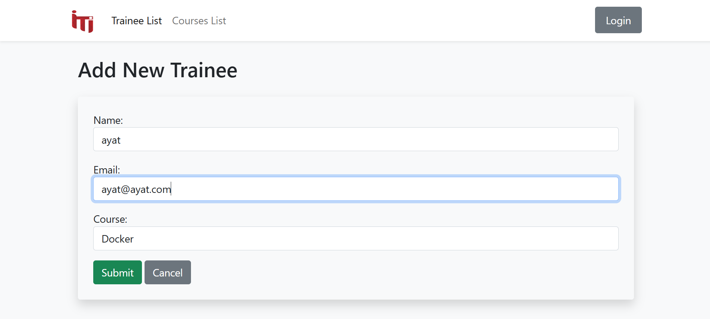

# ITlan Project

## Project Overview
ITlan is a Django-based web application that manages trainees and courses. The project consists of multiple apps, including a **trainee management system** and a **course management system**, as well as authentication functionalities.





## Project Structure
```
ITlan/
│── ITlan/               # Main Django project
│   │── settings.py      # Project settings
│   │── urls.py          # Root URL configuration
│   │── wsgi.py          # WSGI entry point
│   │── asgi.py          # ASGI entry point
│
│── trainee/             # Trainee management app
│   │── views.py         # View functions for trainees
│   │── urls.py          # URL routing for trainees
│   │── templates/       # HTML templates for trainees
│   │── models/          # Model Class for Trainee
│
│── course/              # Course management app
│   │── views.py         # View functions for courses
│   │── urls.py          # URL routing for courses
│   │── templates/       # HTML templates for courses
│   │── models/          # Model Class for Courses
│
│── templates/           # Shared templates
│   │── base.html        # Base template with navbar and footer
│
│── static/              # Static assets 
│
│── manage.py            # Django management script
│── README.md            # Project documentation
```

## Features
### Trainee Management
- `traineeList`: Displays a table of trainees.
- `addTrainee`: Form to add a new trainee (POST request).
- `updateTrainee`: Updates a trainee and redirects to the trainee list.
- `deleteTrainee`: Deletes a trainee and redirects to the trainee list.
- `viewTrainee`: Display details of trainee .

### Course Management
- `courseList`: Displays a table of courses.
- `addCourse`: Form to add a new course.
- `updateCourse`: Updates a course and redirects to the course list.
- `deleteCourse`: Deletes a course and redirects to the course list.

### Authentication
- `login`: User login.
- `logout`: User logout.
- `registration`: User registration.

## Navigation Links
The base template (`base.html`) includes a navbar with links to:
- Trainee List
- Course List

## Setup Instructions
1. Clone the repository:
   ```sh
   git clone https://github.com/Ayat166/ITIan.git
   ```
2. Navigate to the project directory:
   ```sh
   cd ITlan
   ```
3. Create a virtual environment and activate it:
   ```sh
   python -m venv env
   source env/bin/activate  # On Windows use `env\Scripts\activate`
   ```
4. Run the development server:
   ```sh
   python manage.py runserver
   ```
5. Open the browser and visit:
   ```
   http://127.0.0.1:8000/
   ```


# README

## Website

### Overview
This project provides a web application for managing trainees and courses. Users can add, update, delete, and view trainees and courses.

### Installation
1. Clone the repository:
   ```bash
   git clone <repository_url>
   ```
2. Navigate to the project directory:
   ```bash
   cd project_directory
   ```
3. Install dependencies:
   ```bash
   pip install -r requirements.txt
   ```
4. Run migrations:
   ```bash
   python manage.py migrate
   ```
5. Start the development server:
   ```bash
   python manage.py runserver
   ```


## API Endpoints

### Overview
This project includes a REST API for managing trainees and courses using Django REST Framework (DRF).

### API URL Patterns
| URL | Method | View | Description |
|------|--------|------|-------------|
| `/API` | GET | `Trainee_List_Add.as_view()` | List all trainees |
| `/API` | POST | `Trainee_List_Add.as_view()` | Add a new trainee |
| `/API/<int:pk>` | GET | `Trainee_Update_Delete_Generic.as_view()` | Retrieve a trainee |
| `/API/<int:pk>` | PATCH | `Trainee_Update_Delete_Generic.as_view()` | Update a trainee |
| `/API/<int:pk>` | DELETE | `Trainee_Update_Delete_Generic.as_view()` | Soft delete a trainee |
| `/APIcourses/` | GET | `CourseViewSet` | List all courses |
| `/APIcourses/` | POST | `CourseViewSet` | Add a new course |
| `/APIcourses/<int:pk>/` | GET | `CourseViewSet` | Retrieve a course |
| `/APIcourses/<int:pk>/` | PUT | `CourseViewSet` | Update a course |
| `/APIcourses/<int:pk>/` | DELETE | `CourseViewSet` | Delete a course |
| `/API/<int:id>` | PATCH | `update_Course` | Update a course (Function-based view) |


### Running the API
1. Start the server:
   ```bash
   python manage.py runserver
   ```
2. Use Postman or CURL to test the endpoints.
3. Example API request:
   ```bash
   curl -X GET http://127.0.0.1:8000/API/
   ```

